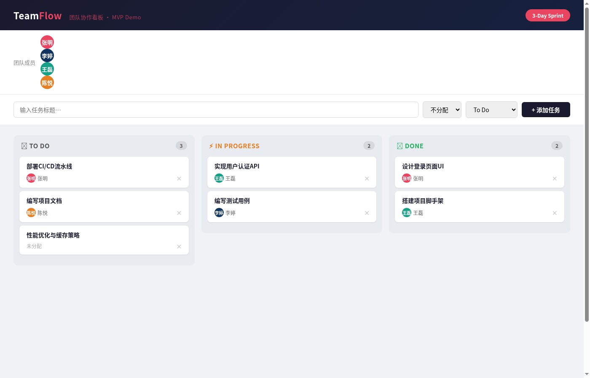

# TeamFlow — 团队协作看板 MVP Demo

## 这是什么

3天冲刺产出的团队协作看板 MVP Demo。纯前端单页应用，零依赖，开箱即用。

## 怎么跑

**方式一：直接打开（最简单）**

用浏览器直接打开 `kanban-demo.html` 即可。所有功能都在一个文件里，不需要装任何东西。

**方式二：本地文件浏览**

```bash
# 克隆仓库
git clone https://github.com/chancetop-com/core-ai-hanckthon-opc-repo.git
cd core-ai-hanckthon-opc-repo
# 直接双击 kanban-demo.html 或用浏览器打开
open kanban-demo.html   # macOS
start kanban-demo.html  # Windows
xdg-open kanban-demo.html  # Linux
```

## 预期结果

打开页面后你会看到：



1. **顶部导航栏** — TeamFlow 品牌标识 + 3-Day Sprint 标签
2. **团队成员栏** — 4位成员的头像（张明、李婷、王磊、陈悦）
3. **添加任务表单** — 输入标题 → 选择负责人 → 选择状态 → 添加
4. **看板三列**：
   - 📋 **To Do** — 待办任务
   - ⚡ **In Progress** — 进行中
   - ✅ **Done** — 已完成
5. **预置示例任务**（7个），覆盖三种状态
6. **拖拽** — 卡片可在列之间拖拽移动状态
7. **删除** — 每个卡片右上角有删除按钮
8. **数据持久化** — 数据自动保存到浏览器 localStorage，刷新不丢失
9. **Toast 提示** — 添加/删除/移动操作有短暂提示

## 功能清单

| 功能 | 状态 |
|------|------|
| 创建任务（标题 + 负责人 + 状态） | ✅ |
| 拖拽卡片变更状态 | ✅ |
| 删除任务 | ✅ |
| 团队成员展示 | ✅ |
| localStorage 数据持久化 | ✅ |
| 预置示例数据 | ✅ |
| 自适应布局 | ✅ |
| 空状态提示 | ✅ |

## 技术栈

- **前端**：纯 HTML + CSS + JavaScript（零依赖）
- **数据**：localStorage 浏览器本地存储
- **交互**：原生 HTML5 Drag & Drop API

## 后续方向

- [ ] 接入后端 API（Python FastAPI）
- [ ] 多用户实时协作（WebSocket）
- [ ] 任务详情编辑
- [ ] 搜索/筛选
- [ ] 更多看板列自定义
